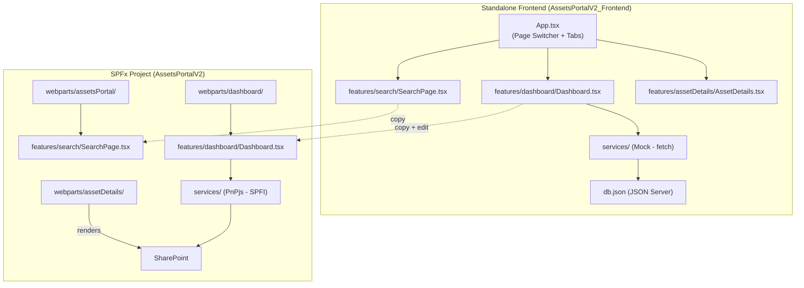

# 🚀 Migration Guide: Frontend → SPFx Project

> How to copy files from `C:\Projects\AssetsPortalV2_Frontend` back into `C:\Projects\AssetsPortalV2`

---

## 📋 Project Overview

| | Standalone Frontend | Original SPFx |
|---|---|---|
| **Location** | `C:\Projects\AssetsPortalV2_Frontend` | `C:\Projects\AssetsPortalV2` |
| **React** | 17.0.1 | 17.0.1 |
| **MUI** | v5.15.14 | v5.15.14 |
| **TypeScript** | ~4.7.4 | ~4.7.4 |
| **Data Layer** | JSON Server (mock) | PnPjs v4 (SharePoint) |
| **Dev Server** | Vite | Gulp (SPFx) |

---

## 🗂️ Folder Structure Mapping

```
AssetsPortalV2_Frontend/src/          →  AssetsPortalV2/src/
├── components/                       →  components/              ✅ DIRECT COPY
│   └── Cards/                        →  Cards/
│       └── StatCard.tsx              →  StatCard.tsx
├── constants/                        →  constants/               ✅ DIRECT COPY
│   └── config.ts                     →  config.ts                ⚠️ Remove MOCK_API_BASE_URL
├── context/                          →  context/                 🔄 REPLACE WITH ORIGINAL
│   └── AppContext.tsx                →  AppContext.tsx
├── features/                         →  features/                ✅ DIRECT COPY (mostly)
│   ├── dashboard/
│   │   └── Dashboard.tsx             →  Dashboard.tsx             ⚠️ Minor edits needed
│   ├── search/
│   │   └── SearchPage.tsx            →  SearchPage.tsx            ✅ Direct copy OR keep original SCSS version
│   └── assetDetails/
│       └── AssetDetails.tsx          →  (see webparts section)
├── hooks/                            →  hooks/                   ✅/⚠️
│   ├── useDebounce.ts                →  useDebounce.ts            ✅ DIRECT COPY
│   └── useSearch.ts                  →  useSearch.ts              🔄 REPLACE WITH ORIGINAL
├── models/                           →  models/                  ✅ DIRECT COPY
│   ├── IAsset.ts                     →  IAsset.ts
│   ├── IDashboardMetrics.ts          →  IDashboardMetrics.ts
│   └── ISearchResult.ts             →  ISearchResult.ts
├── services/                         →  services/                🔄 REPLACE WITH ORIGINAL
│   ├── SearchService.ts              →  SearchService.ts
│   └── SharePointService.ts          →  SharePointService.ts
└── utils/                            →  utils/                   ✅ DIRECT COPY
    └── formatters.ts                 →  formatters.ts
```

---

## 📝 File-by-File Migration Instructions

### Legend
- ✅ **DIRECT COPY** — Copy the file as-is, no changes needed
- ⚠️ **COPY + EDIT** — Copy the file but make small edits
- 🔄 **DO NOT COPY** — Keep the original SPFx version of this file
- 🆕 **NEW FILE** — This file is new, copy it and wire it up

---

### 1. Models (`src/models/`) — ✅ DIRECT COPY ALL

These are identical between both projects. Copy directly.

| Frontend File | → SPFx Destination | Action |
|---|---|---|
| `src/models/IAsset.ts` | `src/models/IAsset.ts` | ✅ Direct copy |
| `src/models/IDashboardMetrics.ts` | `src/models/IDashboardMetrics.ts` | ✅ Direct copy |
| `src/models/ISearchResult.ts` | `src/models/ISearchResult.ts` | ✅ Direct copy |

---

### 2. Utils (`src/utils/`) — ✅ DIRECT COPY ALL

| Frontend File | → SPFx Destination | Action |
|---|---|---|
| `src/utils/formatters.ts` | `src/utils/formatters.ts` | ✅ Direct copy |

---

### 3. Components (`src/components/`) — ✅ DIRECT COPY ALL

Pure MUI components with no SPFx dependencies.

| Frontend File | → SPFx Destination | Action |
|---|---|---|
| `src/components/Cards/StatCard.tsx` | `src/components/Cards/StatCard.tsx` | ✅ Direct copy |

> [!TIP]
> Any **new reusable components** you create in the frontend project should go in `src/components/`. They will copy directly since they are pure React + MUI.

---

### 4. Constants (`src/constants/`) — ⚠️ COPY + EDIT

| Frontend File | → SPFx Destination | Action |
|---|---|---|
| `src/constants/config.ts` | `src/constants/config.ts` | ⚠️ Remove `MOCK_API_BASE_URL` line |

**Edit needed:** Remove this line after copying:
```diff
  export const APP_CONFIG = {
    SEARCH_ROW_LIMIT: 50,
    DEBOUNCE_DELAY_MS: 300,
    APP_TITLE: 'Assets Portal',
    APP_SUBTITLE: 'Search across your SharePoint assets',
-   MOCK_API_BASE_URL: 'http://localhost:3001',
  } as const;
```

---

### 5. Hooks (`src/hooks/`) — MIXED

| Frontend File | → SPFx Destination | Action |
|---|---|---|
| `src/hooks/useDebounce.ts` | `src/hooks/useDebounce.ts` | ✅ Direct copy |
| `src/hooks/useSearch.ts` | `src/hooks/useSearch.ts` | 🔄 **DO NOT COPY** — keep original |

> [!IMPORTANT]
> `useSearch.ts` in the frontend uses the mock `SearchService`. The SPFx version uses `useAppContext()` to get `sp` (SPFI) and passes it to the real `SearchService`. **Keep the SPFx original.**

---

### 6. Context (`src/context/`) — 🔄 DO NOT COPY

| Frontend File | → SPFx Destination | Action |
|---|---|---|
| `src/context/AppContext.tsx` | `src/context/AppContext.tsx` | 🔄 **DO NOT COPY** — keep original |

The frontend version provides `apiBaseUrl` while the SPFx version provides `sp: SPFI` and `context: WebPartContext`. These are fundamentally different.

---

### 7. Services (`src/services/`) — 🔄 DO NOT COPY

| Frontend File | → SPFx Destination | Action |
|---|---|---|
| `src/services/SearchService.ts` | `src/services/SearchService.ts` | 🔄 **DO NOT COPY** — keep original |
| `src/services/SharePointService.ts` | `src/services/SharePointService.ts` | 🔄 **DO NOT COPY** — keep original |

These use `fetch()` calls to JSON Server in the frontend. The SPFx originals use PnPjs. **Keep the SPFx originals.**

---

### 8. Features (`src/features/`) — ⚠️ COPY + EDIT

This is where the main UI logic lives. Most of your development work will be here.

#### 8a. Search Feature

| Frontend File | → SPFx Destination | Action |
|---|---|---|
| `src/features/search/SearchPage.tsx` | `src/features/search/SearchPage.tsx` | ✅ Direct copy (MUI version) |

> [!NOTE]
> The original SPFx project uses an SCSS-based SearchPage with `SearchPage.module.scss`. The new frontend uses a pure MUI version. **You have two choices:**
> - **(a) Use the new MUI SearchPage** — just copy it over (recommended, cleaner)
> - **(b) Keep the original SCSS version** — don't copy, keep the original `.tsx` + `.module.scss` + `.module.scss.ts` files

#### 8b. Dashboard Feature

| Frontend File | → SPFx Destination | Action |
|---|---|---|
| `src/features/dashboard/Dashboard.tsx` | `src/features/dashboard/Dashboard.tsx` | ⚠️ Copy + edit |

**Edits needed after copying:**

1. **Add SPFI import and prop:**
```diff
+ import { SPFI } from '@pnp/sp';
  import { ISearchResult } from '../../models/ISearchResult';
  ...

  export interface IDashboardProps {
    searchQuery: string;
    onBackToSearch: () => void;
    onSearch: (query: string) => void;
+   sp: SPFI;
  }
```

2. **Update SearchService instantiation:**
```diff
- const searchService = React.useMemo(() => new SearchService(), []);
+ const searchService = React.useMemo(() => new SearchService(sp), [sp]);
```

3. **Update component destructuring:**
```diff
- const Dashboard: React.FC<IDashboardProps> = ({ searchQuery, onBackToSearch, onSearch }) => {
+ const Dashboard: React.FC<IDashboardProps> = ({ searchQuery, onBackToSearch, onSearch, sp }) => {
```

#### 8c. Asset Details Feature

| Frontend File | → SPFx Destination | Action |
|---|---|---|
| `src/features/assetDetails/AssetDetails.tsx` | *New location* — see below | 🆕 See note |

> [!NOTE]
> The original SPFx project has AssetDetails at `src/webparts/assetDetails/components/AssetDetails.tsx`. If you build out this page in the frontend project, you can either:
> - Copy it to `src/features/assetDetails/AssetDetails.tsx` (new feature folder, cleaner)
> - OR directly update `src/webparts/assetDetails/components/AssetDetails.tsx` — but you'll need to add SPFx props (`sp`, `context`) and wrap with `AppProvider`/`ThemeProvider`

---

### 9. Webpart Shell Files — 🔄 DO NOT COPY

These files are **SPFx-specific** and don't exist in the frontend project. Leave them untouched:

```
src/webparts/assetsPortal/
  ├── AssetsPortalWebPart.manifest.json    — SPFx manifest
  ├── AssetsPortalWebPart.ts               — SPFx webpart entry
  ├── components/IAssetsPortalProps.ts      — SPFx props interface
  └── loc/                                 — SPFx localization

src/webparts/dashboard/
  ├── DashboardWebPart.manifest.json
  ├── DashboardWebPart.ts
  ├── components/IDashboardProps.ts
  └── loc/

src/webparts/assetDetails/
  ├── AssetDetailsWebPart.manifest.json
  ├── AssetDetailsWebPart.ts
  ├── components/IAssetDetailsProps.ts
  └── loc/
```

---

### 10. Files to NOT copy (Frontend-only)

These files exist only in the frontend project and should **NOT** be copied to SPFx:

| File | Reason |
|---|---|
| `package.json` | Different dependencies |
| `tsconfig.json` | Different config |
| `vite.config.ts` | Vite-specific |
| `vite-env.d.ts` | Vite-specific |
| `index.html` | Vite entry |
| `db.json` | Mock data |
| `src/index.tsx` | Vite entry |
| `src/App.tsx` | Page switcher (SPFx uses webparts) |
| `.gitignore` | Different ignores |

---

## 🔄 Quick Copy Checklist

When you're ready to migrate, follow this order:

```
□ 1. Copy src/models/*.ts                    → src/models/
□ 2. Copy src/utils/formatters.ts            → src/utils/
□ 3. Copy src/components/Cards/StatCard.tsx   → src/components/Cards/
□ 4. Copy src/constants/config.ts            → src/constants/     (remove MOCK_API_BASE_URL)
□ 5. Copy src/hooks/useDebounce.ts           → src/hooks/
□ 6. Copy src/features/search/SearchPage.tsx → src/features/search/   (if using MUI version)
□ 7. Copy src/features/dashboard/Dashboard.tsx → src/features/dashboard/  (edit SPFI refs)
□ 8. Copy any NEW components from src/components/ → src/components/
□ 9. Do NOT copy: context/, services/, useSearch.ts, App.tsx, index.tsx
□ 10. Do NOT copy: package.json, tsconfig.json, vite.config.ts, db.json
```

---

## ⚙️ Running the Frontend Project

```bash
# 1. Navigate to the project
cd C:\Projects\AssetsPortalV2_Frontend

# 2. Install dependencies
npm install

# 3. Start both mock API and dev server
npm start

# This runs:
#   - JSON Server on http://localhost:3001 (mock API)
#   - Vite dev server on http://localhost:3000 (frontend)
```

> [!TIP]
> You can also run them separately:
> ```bash
> npm run mock-api   # Just the mock API
> npm run dev        # Just the frontend
> ```

---

## 🏗️ Architecture Diagram



> [!CAUTION]
> **Never copy** `context/AppContext.tsx`, `services/*.ts`, or `hooks/useSearch.ts` from the frontend project to SPFx. These files have mock implementations that will break the SharePoint integration.
